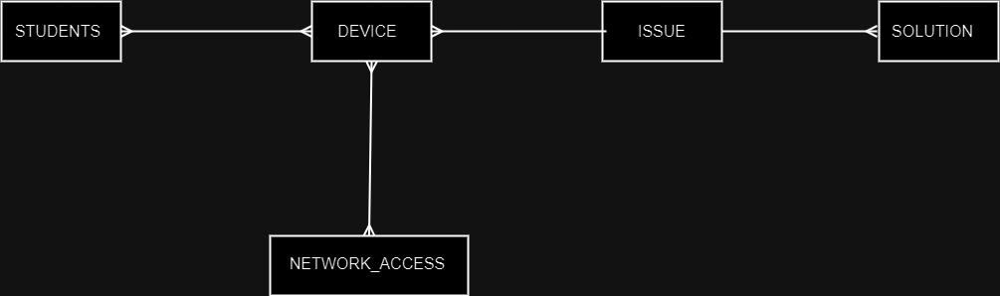
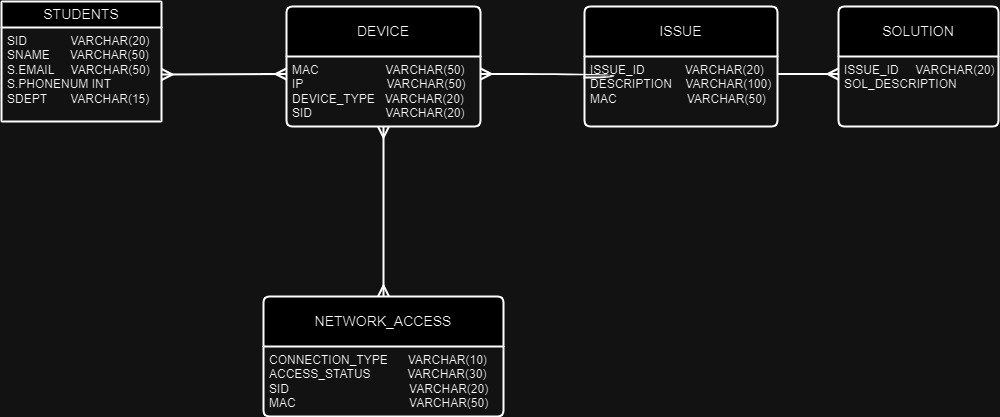
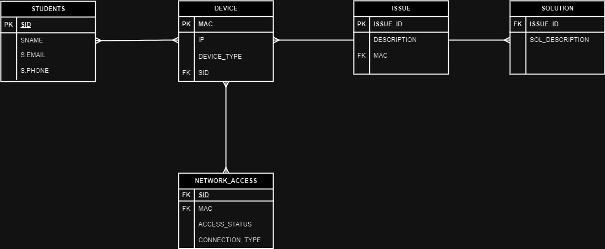
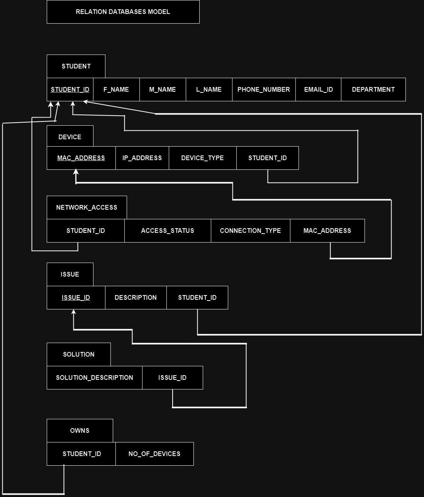

# 📡 NARS – Network Access Registration System

**NARS** is a full-stack web-based system designed to streamline LAN access requests in a campus environment. Students can register their devices and report issues; administrators manage access, resolve issues, and generate reports. This project enhances efficiency, security, and transparency in campus network administration.

---

## 🧩 Features

- 🔐 **User Login:** Secure authentication using student ID/email
- 🖥️ **Device Registration:** MAC & IP address entry for network access
- 📊 **Admin Dashboard:** View requests, grant/deny LAN access
- 🛠️ **Issue Reporting:** Students can report network/device problems
- 📁 **Solutions & Reports:** Admins can resolve issues and generate usage reports
- 📤 **Export Support:** Reports downloadable in PDF/TXT formats
- 📚 **Role-Based Access:** Admin and student-level permissions

---

## 🌐 Tech Stack

| Frontend        | Backend      | Database   |
|----------------|--------------|------------|
| HTML, CSS, JS  | PHP          | MySQL via phpMyAdmin |

---

## 📐 System Architecture

- **Database Entities:** `student`, `device`, `network_access`, `issue`, `solution`
- **ER Diagram:** 
- **Conceptual Design:** 
- **Logical Design:** 
- **Physical Design:** 
- **Relational Schema:** 

---

## 🔄 Flow of Operation

1. Student logs in via web portal
2. Submits LAN access request with device details
3. Admin views request and decides to approve/deny
4. System updates access status and logs activity
5. Issues can be reported by students and resolved by admins

---

## 📋 Sample SQL Queries

```sql
-- Fetch student with specific ID
SELECT * FROM student WHERE student_id = 'CS22B1012';

-- Get students by department
SELECT * FROM student WHERE department = 'CSE';

-- Find students whose access was denied
SELECT * FROM network_access WHERE access_status = 'Denied';

-- List all issues
SELECT * FROM issue;

-- Retrieve all registered students
SELECT * FROM student;
